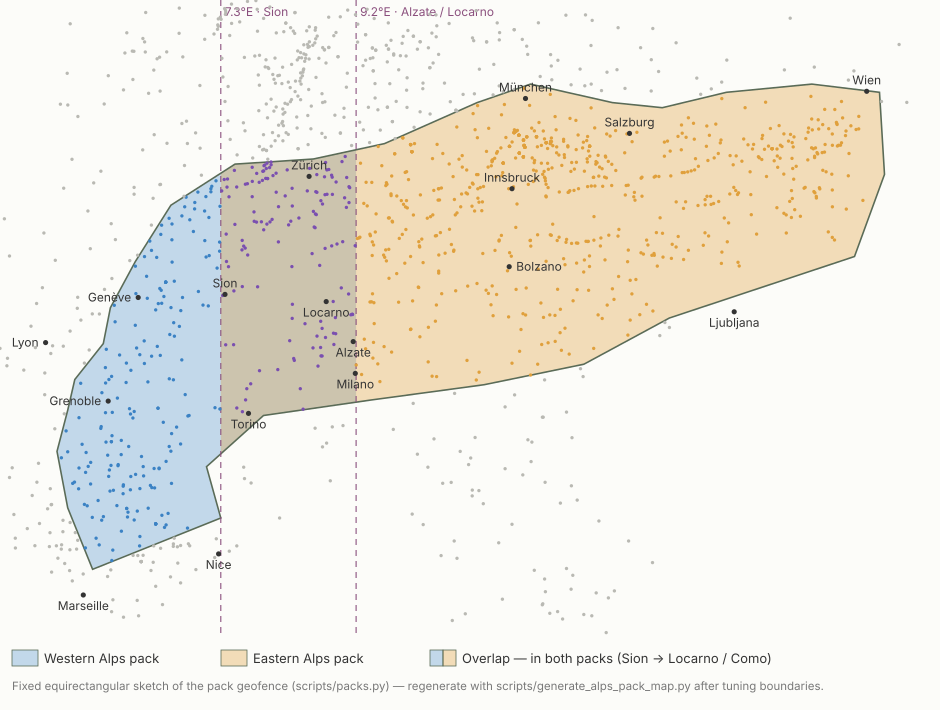

# Meet the Cows

Meet the Cows is an offline-friendly landing-field viewer for glider pilots, designed to run as a phone web app in the cockpit.

**Live app: <https://app.meetthecows.org>** — open it on your phone and add it to your home screen.
Project site: <https://meetthecows.org>.

Install it on your phone, open it before or during a flight, allow location access, and it shows nearby outlanding fields and airfields with distance, bearing, required glide ratio, notes, photos, and available documents such as VAC PDFs.

## Safety

This app is intended as a cockpit aid for quick field briefing and triage only. It is provided as-is, without warranty, guarantee, operational approval, or assumption of responsibility by its author or contributors.

Meet the Cows is not primary navigation. It does not account for wind, sink, airspace, obstacles, NOTAMs, legality, surface condition, livestock, crops, wires, slope, current weather, or the pilot's actual aircraft performance.

It does account for terrain, in one narrow sense and no further: the required glide ratio can be computed along a path that stays clear of the ground rather than along the straight line (see [Terrain-routed glide](#terrain-routed-glide)). That is a better arithmetic answer to "what glide does this field cost", not a route to fly and not a clearance to fly it. The path is found on a coarse elevation grid with no knowledge of wind, sink, airspace, or your aircraft; the app never tells you which way to point the nose, and every caveat above still applies unchanged.

The pilot in command is solely responsible for all flight planning, navigation, field selection, landing decisions, and consequences of using or not using any information shown by the app. Always use official and current sources, local knowledge, active lookout, and established navigation tools for flight decisions.

Difficulty `C` and `D` fields are highly contraindicated. Treat them as hazardous, last-resort emergency options only, not as normal landing choices.

## Features

- Nearby fields from your current GPS position
- Three best safe options (difficulty `A`, required glide ratio 20 or better, airfields first) pinned above the list
- Distance, bearing, and required glide ratio — straight-line, or routed around terrain
- Terrain-routed glide: the required ratio follows a path that stays clear of the ground, so a
  field down a valley can become reachable and one behind a ridge can stop being
- Route profile in the field detail view: the ground, the clearance line above it, and the glide
  drawn at the ratio being reported, marked where the two meet
- Named cols from OpenStreetMap, so the limiting point reads "via Col de Joux" rather than a bearing
- Arrival height: how far above the field the routed glide actually gets you
- Safety arrival margin setting
- Testing mode: place the app at any searched location and altitude to check figures on the ground
- Filters for more difficult fields
- Field detail view with notes, photos, and documents
- Full French / English / German localization — the interface and field notes follow your device language, with a manual switch in Settings
- Installable PWA with offline app shell that updates itself on next launch
- Offline download of pack media and documents
- In-app prompt when new field data is published, downloading only what changed

## Install on a Phone

1. Open <https://app.meetthecows.org> in your phone browser.
2. On iPhone, use Safari's share button, then choose `Add to Home Screen`.
3. On Android, use the browser menu, then choose `Install app` or `Add to Home screen`.
4. Launch Meet the Cows from the home-screen icon.
5. Allow location access when prompted.

For cockpit use, open the app before launch while you still have a good connection, let it load the pack, and download media/docs if you want them available offline.

## Using Offline

The app shell and core pack files (field list and manifest) are cached automatically by the service worker and refreshed from the network whenever you open the app online.

Photos and PDFs can be large, so they are not all cached automatically. To make them available offline the first time:

1. Open Settings.
2. Tap `Download / verify media & docs`.
3. Keep the app open until the progress line finishes.

This downloads every photo and document for the pack and records what you have so later updates only fetch the difference.

Terrain tiles are separate, under **Settings → Terrain → Download terrain**, and are offered only
for the ground your selected packs actually cover — not the whole published set. Settings shows
the tile count and size before you commit to it. Without them, terrain routing works online and
falls back to the straight-line glide offline; with them, it works in the air like everything else.

## Updates

Updates are only ever offered, never applied in flight. You choose when to reload or sync, on the ground with a good connection.

### App updates

The app updates itself: the next time you open it online, it loads the latest version automatically. An app update no longer clears your downloaded photos and documents — the app shell and the offline pack live in separate caches.

### Data updates

When a newer data pack is published, a `New field data available` banner appears at the top of the list. Tap `Update` to sync; the app opens Settings so you can watch the progress. It refreshes the field text, then downloads only the media and documents that actually changed, removes any that were dropped, and skips everything you already hold — so a routine update is a small download, not the whole pack.

## Using in Flight

1. Launch the home-screen app.
2. Wait for the GPS status to become available.
3. Use the nearest list to compare distance, bearing, required glide ratio, and difficulty. The three best safe options (difficulty `A`, required glide ratio 20 or better, airfields preferred) are pinned above the thicker divider.
4. Tap a field to review notes, photos, documents, and VAC material — plus the route and its
   profile, when the glide is routed around terrain.
5. Adjust the safety arrival margin in Settings if you want a more conservative glide estimate.

The app uses phone GPS altitude when available. If your browser does not provide altitude, the required glide ratio is not shown — Settings has a testing mode for checking figures on the ground.

## Terrain-routed glide

A straight-line glide ratio is wrong in the mountains in both directions. It refuses a field that
a valley leads down to below the ridge line, and it offers one with a ridge in the way. Cervinia
to Aosta is the case that drove this: from 3,000 m the direct line crosses a 3,000 m wall and
reads as impossible, while the run down the Valtournenche into the Aosta valley needs a required
glide of about 17.

With **Settings → Terrain → Fly the glide around terrain** on, the required ratio is computed
along the best terrain-clearing path instead. Where the routed path is more than 10% longer than
the direct line, the list row carries a chip — `▲ 34 km via Col de Saint-Pantaléon`, or
`▲ 34 km around terrain` when no named col is close enough. Flat country sees no chip and no
change at all: the straight line is still the best line, so it is still the answer.

The field detail view then adds a **Route** block:

- how far the routed path is, in how many legs, against the direct distance
- the point that actually limits the glide, its ground elevation, and how far away it is
- how far below you that point sits now, and what the glide clears it by
- a profile: the ground along the route, the clearance line above it, and the glide drawn at the
  ratio being reported — marked where those two meet, which is where the number is decided
- an **Arrival** card: the height the routed glide reaches the field with

That last one is worth a word. When a col sets the ratio rather than the arrival does, the glide
is sized for the col — it crosses that with the clearance and then keeps descending at the same
slope to a field that needed far less, so it arrives well above the safety margin. From Cervinia
to Aosta that is about +430 m against a 250 m margin. When the arrival is what sets the ratio, the
card reads the margin exactly: there is nothing spare.

### Terrain clearance

**Settings → Terrain → Terrain clearance** is the one new preference: the minimum height a routed
glide has to keep above the ground along its whole length, 100–500 m in 50 m steps, 200 m by
default. Raise it for more room to turn away from rising ground; lower it to reach further.

It is a judgement call that varies with terrain and comfort, which is why it is exposed at all.
Note that at the reported ratio you clear the limiting point by exactly this figure — that is what
"limiting point" means — so the number the app gives you is bounded by your own margin rather than
by the ground.

### What it does not do

No glide performance is ever assumed. The app reports the ratio a field *requires*; comparing that
with what your aircraft actually achieves, in the air you actually have, stays with you.

The path is not a route to fly. It is the geometry that justifies a number, found on a coarse grid
with no knowledge of wind, sink, airspace, or airmanship. The app deliberately does not name a
direction to head — an earlier version's fallback chip said things like "west of track", which
reads as an instruction, and it was removed for that reason. Navigation belongs in your navigation
app.

### The terrain data

Elevations come from the [Copernicus DEM](https://dataspace.copernicus.eu) GLO-30 product, built
into 1° tiles of 16-bit metres at 3 arc-seconds (about 92 m) by `scripts/build_terrain_tiles.py`.
Downsampling takes the **maximum** of each source block rather than the mean, so a summit is never
averaged away into a col that is not there — the error is always on the side of refusing a glide.

That conservatism is visible in the app: near a saddle the max-pooled cell catches the shoulder
beside the notch, so the elevation shown for a named col can sit ~100 m above its surveyed height.
The route block quotes the DEM throughout rather than the surveyed figure, because that is the
ground the glide was measured against, and because the difference errs the safe way.

Col and pass names are named `natural=saddle` / `mountain_pass=yes` nodes from OpenStreetMap,
fetched per bounding box by `scripts/fetch_cols.py`. They are optional decoration: without them
the app still reports the limiting point, just without a name.

Both are built and published by the manually dispatched `Build terrain tiles` workflow — the
ground does not move, so this is deliberately not on the nightly pack schedule.

## Ground Testing

Settings → **Testing** puts the app at a place and altitude of your choosing, so the numbers can
be checked without leaving the ground.

1. Open Settings and expand `Testing` at the bottom.
2. Search for a place — a town, an airfield, a peak.
3. Pick a result, and set the altitude with the slider.
4. Check that distance, glide ratio, filters and the field detail view behave as expected.
5. `Stop testing` returns to real GPS.

An earlier version of this only let you override the altitude, which stopped being enough once
glide started depending on the ground: a plausible altitude in the wrong valley tells you nothing,
and every interesting case is somewhere you are not standing.

While a simulated position is in force a red banner sits above everything, on every screen, saying
so. That is deliberate — a cockpit aid quietly reporting fields near a place you are not is the
worst thing this app could do. The mode needs a connection, caches nothing, and its position is
never used to answer anything the app cannot answer from GPS.

Place search is [Photon](https://photon.komoot.io), on OpenStreetMap data. Nominatim would be the
obvious choice but sends no `Access-Control-Allow-Origin`, so a browser cannot call it.

## Languages

Meet the Cows is available in French, English, and German. On first launch it follows your
device language and falls back to English for anything else. You can override it any time in
Settings → App → Language; the choice is stored on the device.

Localization covers the whole app: menus and status text, field detail labels, warnings, and
the field notes themselves. The exported SeeYou CUP file is generated in the language you have
selected (its filename is suffixed with the language code).

The landing page at [meetthecows.org](https://meetthecows.org) is English and French, each on its
own URL (`/` and `/fr/`) with `hreflang` alternates and a switcher in the header. A browser asking
for French is *offered* the French page rather than sent to it: `Accept-Language` is set for the
browser's reasons, not the reader's, and a page that moves under someone who deliberately opened
the English one is a bug they cannot undo.

## Community contributions

Pilots can crowd-source field updates from inside the app: search for a field, open it, and
use **Contribute an update** to submit a dated note and/or a photo. Submissions go through a
Cloudflare Worker (`worker/`) that spam-gates with Turnstile, reads the photo's EXIF GPS to
**pre-verify the location** (within 1 km of the field; a far-away device position is ignored),
strips EXIF, uploads the full-size original as a release asset, and opens a **pull request** —
nothing is published until a maintainer merges it. On the next data-pack build, merged
contributions are folded into the field's notes (as localized, dated "Pilot report" fragments)
and media (photo resized like any other pack image). Contribution photos never enter git;
originals live on the `contrib-originals` release.

## Data

The public app loads static data packs from `data.meetthecows.org`, an R2 bucket whose layout
mirrors the site; a plain checkout with no deployment config falls back to same-origin `packs/…`
paths and behaves identically. One build produces
the country packs (`fr`, `ch`, `de`, `it`, `at`) and two geofenced Alps packs, all sliced from
one merged field set with their media shared in `_shared/`:

```text
/meet-the-cows/packs/packs.json
/meet-the-cows/packs/<pack-id>/manifest.json
/meet-the-cows/packs/<pack-id>/fields.json
/meet-the-cows/packs/<pack-id>/media-manifest.json
/meet-the-cows/packs/<pack-id>/state.json
/meet-the-cows/packs/_shared/media/...
/meet-the-cows/packs/_shared/docs/...
/meet-the-cows/packs/_terrain/index.json
/meet-the-cows/packs/_terrain/cols.json
/meet-the-cows/packs/_terrain/N45E007.terr
```

`_terrain/` is shared by every pack and built on its own schedule — see
[Terrain-routed glide](#terrain-routed-glide). `index.json` lists each tile with its size and
SHA-256; the app fetches only the tiles overlapping the packs you have selected.

`media-manifest.json` lists a content hash for every media/doc file; the app diffs it to
download only changed files on an update. `state.json` is the source fingerprint the build
uses to decide whether a rebuild is needed. Generated pack files are not committed to the repository.

### Alps pack boundaries

The Alps ship as two overlapping packs so pilots download only the side they fly: **Western
Alps** reaches east to Alzate/Locarno (9.2°E) and **Eastern Alps** starts at Sion (7.3°E).
The Sion → Locarno / Como corridor between the two is carried by both packs; fields shared by
two selected packs are deduplicated by the app and never downloaded twice.



The boundary polygon lives in `scripts/packs.py` (`ALPS_GEOFENCE` plus the two split
longitudes); regenerate the map with `python scripts/generate_alps_pack_map.py` after tuning it.

## Credits and Data Sources

Meet the Cows stands on work published by several aviation and gliding data providers. Please respect each source's terms, licences, and attribution requirements.

- planeur-net: outlanding fields.
- [Service de l'Information Aeronautique (SIA)](https://www.sia.aviation-civile.gouv.fr): official French VAC documents where included.
- [Austro Control](https://www.austrocontrol.at): Austrian AIP aerodrome charts (CC BY 4.0 per AIP Austria GEN 3.2) where included.
- [DFS Deutsche Flugsicherung](https://aip.dfs.de/basicVFR): German AIP VFR (BasicVFR) aerodrome charts where included.
- [ENAV](https://www.enav.it): Italian AIP aerodrome and visual approach charts (© ENAV S.p.A., retrieved from the free online self-briefing service) where included.
- [OpenAIP](https://www.openaip.net): airfield metadata used to help discover and place glider-relevant airfields.
- [OurAirports](https://ourairports.com): optional airport/runway coordinate fallback for some pack builds.
- [Copernicus DEM](https://dataspace.copernicus.eu) (GLO-30): terrain elevations for terrain-routed
  glide — © ESA, Sinergise; produced using Copernicus WorldDEM-30.
- [OpenStreetMap](https://www.openstreetmap.org/copyright) contributors (ODbL): named cols and
  passes, and the [Photon](https://photon.komoot.io) place search used by Ground Testing.

The exact sources used by a deployed pack are listed in that pack's `manifest.json`.

## Licence

- **Source code**: [PolyForm Noncommercial 1.0.0](LICENSE) — free for any noncommercial use
  (pilots, clubs, personal forks); commercial use requires a licence. Versions published before
  this change remain available under their original MIT licence.
- **Data** (packs, notes, photos, documents, CUP exports, contributions): free for personal,
  noncommercial use through the app; extracting, redistributing or building on the data is
  **on request** — see [DATA-LICENCE.md](DATA-LICENCE.md). Third-party sources keep their own
  terms.

## Deployment

Three separate origins, on purpose — a browser scopes service workers, caches and local storage
per origin, so the app, the landing page and any experimental build can never disturb each other:

| Origin | What it is | Deployed as | Workflow |
|---|---|---|---|
| `app.meetthecows.org` | the PWA | Worker `meet-the-cows-app` | `deploy-app.yml` (branch `main`) |
| `next.meetthecows.org` | experimental build, shared by hand and marked `noindex` | Worker `meet-the-cows-next` | `deploy-app.yml` (branch `dev`) |
| `meetthecows.org` | landing page | Worker `meet-the-cows-site` | `deploy-site.yml` (`site/`) |
| `data.meetthecows.org` | pack data in R2 | R2 bucket | `build-data-pack.yml` |

The app and the channel build share one `deploy/wrangler.toml` and differ only by the `--name`
passed to `wrangler deploy`. That is deliberate: a channel served by a different stack than
production rehearses the wrong thing, and the difference shows up exactly where it is least
welcome — header handling, cache defaults, 404 behaviour. Everything is a Worker because Pages is
being folded into Workers and this account can no longer create Pages projects.

Deployment is split so app-only changes do not rebuild the data pack:

- `.github/workflows/deploy-app.yml` deploys app-shell changes using the latest already-built pack.
- `.github/workflows/build-data-pack.yml` rebuilds the data pack, assembles the full static site, and deploys it. It runs manually, on schedule, and when the data-build scripts change.

### Where a deployment points (config.js)

The app shell is origin-relative, so the same build runs at any URL. `config.js` — loaded both by
`index.html` and, via `importScripts`, by the service worker, so the two can never disagree —
carries the few things that differ per deployment:

| Field | Meaning |
|---|---|
| `packsBase` | Base that `packs/…` paths resolve against. Empty = same origin as the app; set it to serve pack data from a separate host so the shell and the ~300 MB of packs deploy independently. |
| `channel` | Label for a non-production deployment. Any non-empty value also suppresses the migration notice, because an experimental build is a deliberate destination, not a retired one. |

The committed values are all empty, so a plain checkout behaves exactly like the original
single-origin site. Both workflows overwrite the file at deploy time from the `PACKS_BASE_URL`
repository variable.

The app's own address and the landing site are deliberately *not* config: they are constants at
the top of `src/app.js`. A copy served from any other origin understands itself to be retired and
offers a guided move — silent on the canonical origin, on a labelled channel, and on localhost.
They live in the shell rather than in deploy-time config because the copy that most needs them is
the retired one, which by definition stops being deployed to and would never receive them. Once a
retired origin has been handed a shell that knows this, it keeps saying so with nothing left
switched on anywhere; `deploy-app.yml`'s `deploy_retired_origin` input does that one deploy.

### Deploy target

`DEPLOY_TARGET` (repository variable) selects where the assembled site goes — `cloudflare` for the
Workers deploy that serves the live app, unset for GitHub Pages. The Cloudflare path is a direct
upload rather than a git-connected build, so the heavy pack build stays in Actions with its caches
and secrets and Cloudflare only receives the finished directory. `main` deploys to the Worker
`meet-the-cows-app`, every other branch to `meet-the-cows-next`.

The GitHub Pages path is now only the retired origin, `br0c.github.io/meet-the-cows`. It runs on a
manual dispatch with the `deploy_retired_origin` input, whose one job is to hand that frozen copy a
shell that knows the app has moved. There was also a Cloudflare **Pages** deploy here, from the
period when `app.meetthecows.org` was still attached to a Pages project; both custom domains are on
Workers now, so it was removed.

When `PACKS_BASE_URL` is set, `scripts/publish_packs_r2.py` uploads the pack tree to an R2
bucket (S3 API, hash-compared so only changed objects move) and the packs are then left out of
the site upload — a deployment becomes a few hundred KB instead of 300 MB, and every app
deployment reads the same pack data.

Major commercial/controlled airports and active military bases — where a glider must not land — are excluded from the pack so they never appear as landing options. They otherwise leak in from the landout sources and dominate the pinned "best options". The rule is source-agnostic: any airfield with a paved runway of 2000 m or more, plus a short explicit ICAO list for the major/military fields with shorter runways (both in `scripts/build_pack.py`). Real gliding aerodromes in this dataset top out around 1300 m, so this does not touch soaring sites.

The data-pack build is incremental: it fingerprints the upstream sources (Guide CUPX, SIA VAC cycle) and skips the rebuild and deploy entirely when nothing has changed, so the daily run is a no-op on quiet days. It does a full refresh on pushes, on manual runs, and once a week. Field notes are localized into English, French, and German and stored per language in `fields.json`, so the app can show each note in the pilot's language. Each note is kept native in its own source language — French Guide prose stays French — and only translated into the other two languages via DeepL, so nothing is round-tripped through a third language and no credits are wasted re-encoding a note into its own language. Translations are cached across runs, so only new or changed text is re-translated. The cache is also published with the deployed pack and re-seeded from there whenever the CI cache is evicted, so losing the CI cache never re-spends DeepL quota. Without a DeepL key the notes fall back to their source language in every slot.

## Contributing

Field corrections and photo contributions are welcome. Include the field name or code, describe the issue clearly, and cite a useful source when possible.

Only contribute photos or documents you own or have permission to share.
